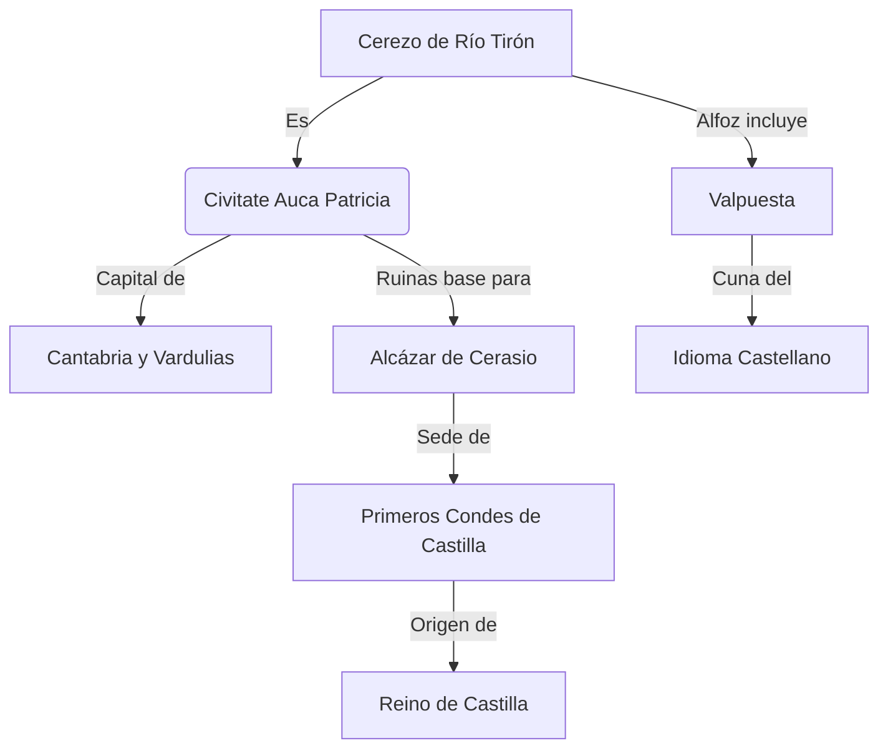
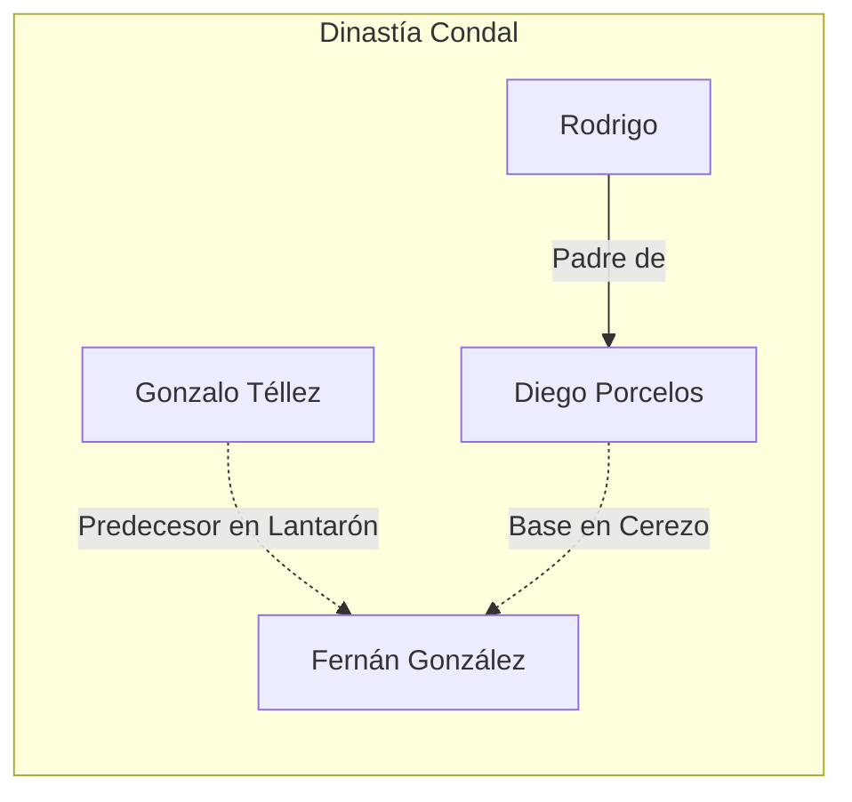

---
tags:
  - Historia
  - Castilla
  - Arqueología
  - CerezoDeRíoTirón
  - AucaPatricia
  - Roma
  - Visigodos
aliases:
  - Origen de Castilla
  - Auca Patricia
  - Cuna del Castellano
status: Cultivo
created: 2025-11-27
---

# 🏛️ Cerezo de Río Tirón: La Verdadera Auca Patricia y Cuna de Castilla

> [!ABSTRACT] Tesis Central
> **Cerezo de Río Tirón** no es solo un pueblo con encanto; es la ubicación histórica de la **Civitate Auca Patricia**, capital de la Cantabria romana y visigoda. Aquí, sobre las ruinas de una monumental ciudad romana, se erigió el **Alcázar de Cerasio**, el verdadero origen del **Condado de Castilla** y cuna del idioma castellano.

> [!WARNING] Controversia Histórica
> La historia oficial sitúa a menudo el centro de poder en Burgos o Lara. Sin embargo, **Cerezo y Lantarón** aparecen como condados primigenios. La **Episcopi de San Martín** en Cerezo, con sus 116 metros de largo (mayor que la Catedral de Burgos), sugiere una sede episcopal de primer orden: la **Silla Aukensi**.

| Estructura | Longitud Aprox. | Notas |
| :--- | :--- | :--- |
| **Episcopi San Martín (Cerezo)** | **116 m** | Posible sede de Auca Patricia |
| Catedral de Burgos | 88 m | Referencia gótica posterior |
| Catedral de Bilbao | 55 m | Referencia comparativa |

---

## ✝️ Leyendas, Religión y el Camino

La historia sagrada se entrelaza con la militar.

- **[[San Vitores]]**: Su martirio en el circo romano de Auca conecta la tradición cristiana con el pasado imperial.
- **[[San Jorge]] y [[Santiago]]**: Ramiro I funda en el año 842 el **Hospital de San Jorge** en Cerasio, atendido por monjes de San Antón (tau en el pecho). Esto sitúa a Cerezo en el primitivo **Camino de Santiago** (Vía Romana de Tarragona a Astorga) antes de su desvío en el siglo XI.

---

## 🎬 Narrativa: La Resistencia de Corocotta

*Reconstrucción narrativa basada en la hipótesis de Segisamam (Cerezo) como último bastión cántabro.*

> **Escena 1: El Plan de Augusto**
>
> El sol se pone tras las colinas del Palatino. **César Augusto**, junto a su general **Agripa**, traza el plan definitivo para someter Hispania.
>
> — *Mañana partiremos hacia Hispania. Es hora de acabar con la rebelión de los cántabros.*
> — *Los cántabros son guerreros feroces, mi señor. Su capital, **Segisamam**, es una fortaleza inexpugnable rodeada por tres ríos.*
>
> El plan es audaz: un ataque combinado por tierra y río, utilizando el Ebro para transportar legiones hasta el corazón de la resistencia.

> **Escena 2: La Fortaleza de Segisamam**
>
> En la cima de la colina, **Corocotta**, caudillo de los cántabros, celebra el nacimiento de su hija. El ambiente es de fiesta, pero la tensión se palpa. El druida del pueblo profetiza:
>
> — *He visto sangre y fuego. Pero también he visto gloria. Tu nombre resonará por toda Hispania como un grito de libertad.*
>
> Segisamam no es solo una aldea; es un complejo defensivo masivo, el "último puerto", donde se decidirá el destino de los pueblos del norte.

---

## 🔮 Conclusión: Pulir el Alabastro

Cerezo de Río Tirón es un "pueblo de alabastro puro" metafórica y literalmente. Su historia ha sido oscurecida, sus piedras reutilizadas y sus nombres olvidados o cambiados (*Viesca* por Oca, *Cerasio* por Cerezo).

> [!TIP] Llamada a la Acción
> *"Yo en vez de llevarme las manos a la cabeza... coja una piedra y la pula."*
> Es hora de redescubrir la **Auca Patricia**, limpiar el polvo de la historia y reconocer en Cerezo el **Origen del Castellano** y la cuna de Castilla. La arqueología extrema y la revisión de las fuentes nos esperan.

---
**Etiquetas**: #CerezoDeRíoTirón #HistoriaDeEspaña #ImperioRomano #EdadMedia #MisteriosArqueológicos
