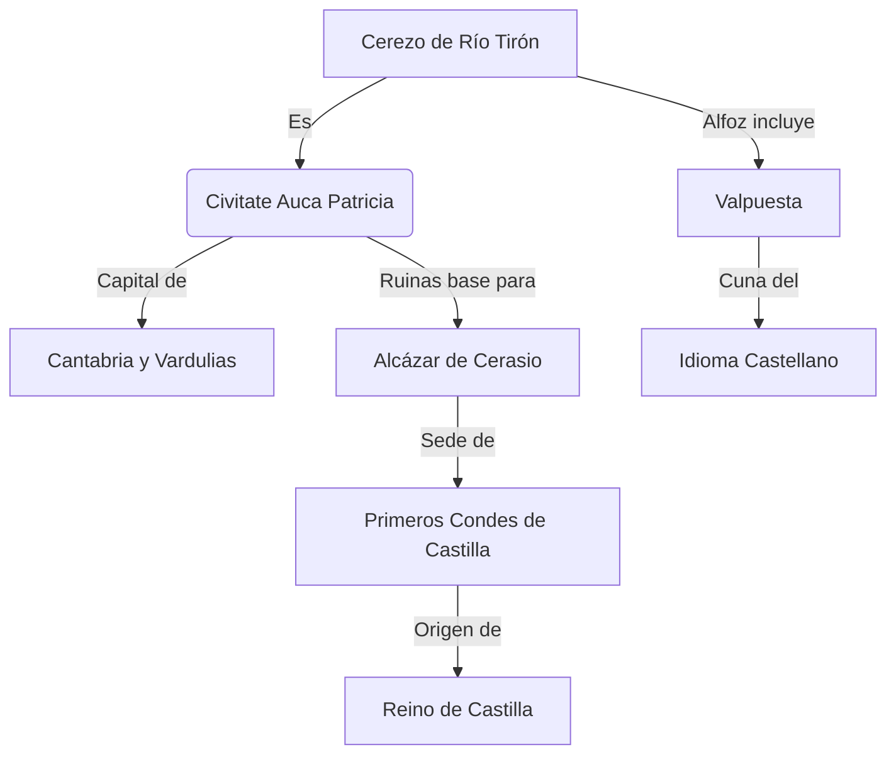
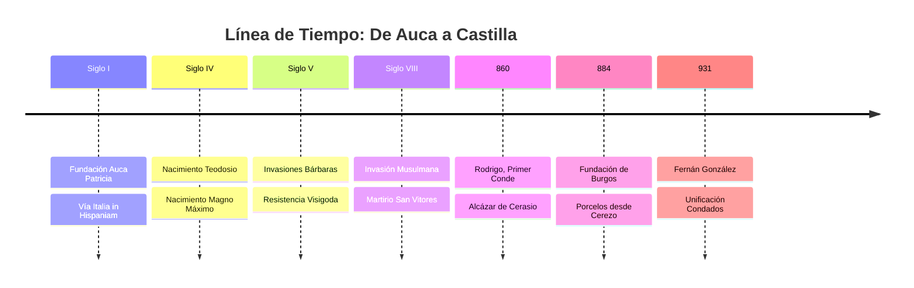
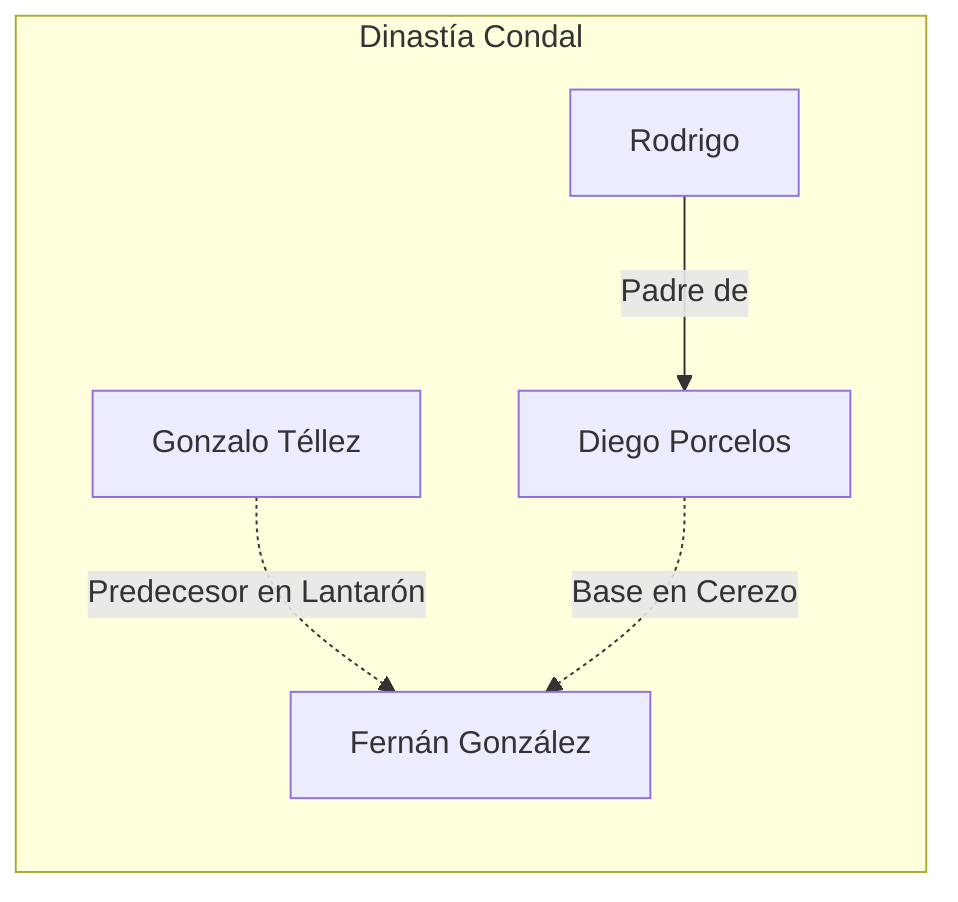

---
tags:
  - Historia
  - Castilla
  - Arqueología
  - CerezoDeRíoTirón
  - AucaPatricia
  - Roma
  - Visigodos
aliases:
  - Origen de Castilla
  - Auca Patricia
  - Cuna del Castellano
status: Cultivo
created: 2025-11-27
---

# 🏛️ Cerezo de Río Tirón: La Verdadera Auca Patricia y Cuna de Castilla

> [!ABSTRACT] Tesis Central
> **Cerezo de Río Tirón** no es solo un pueblo con encanto; es la ubicación histórica de la **Civitate Auca Patricia**, capital de la Cantabria romana y visigoda. Aquí, sobre las ruinas de una monumental ciudad romana, se erigió el **Alcázar de Cerasio**, el verdadero origen del **Condado de Castilla** y cuna del idioma castellano.

---

## ⚔️ La Huella Romana: Auca Patricia

La evidencia arqueológica y toponímica sugiere que Cerezo de Río Tirón alberga una ciudad romana de dimensiones imperiales, oculta bajo "metro y medio de polvo de miles de años".

### 🏙️ La Ciudad y el Campamento

Se han identificado restos que apuntan a una **Civitate Patriciani** (Ciudad Patricia) de gran envergadura:

- **Decumanus y Cardo**: Ejes viarios de **1200 metros** de longitud.
- **Campamento Legionario**: En el término de *La Tejera*, se observan torres torcidas y restos de un campamento de piedra.
- **Murallas y Fosos**: El *Paseo de la Cárcaba* corresponde al foso de la ciudad romana. El río *Vallúm* (hoy San García) actuaba como muralla natural y foso defensivo.

> [!INFO] Dato Arqueológico
> 
> Las monedas romanas halladas en la zona muestran una **puerta de campamento romano con una estrella arriba**. Curiosamente, el escudo de Cerezo conserva esta misma estrella sobre un castillo/torre. ¿Coincidencia o memoria histórica?

### ⚓ El Puerto Fluvial del Ebro

Cerezo habría sido el **último puerto fluvial navegable del Río Ebro** en la antigüedad, situado en el *Gurugú de Segisamam*.

- **Conexión**: Vía de entrada para las legiones romanas desde el Mediterráneo (Vareia/Logroño) hacia el corazón de Cantabria.
- **Glera de los Cellox**: Topónimo que hace referencia a los *celox*, embarcaciones rápidas de la flota romana.

### 👑 Cuna de Emperadores Hispanos

La tradición y ciertas interpretaciones históricas vinculan a **Auca** con el nacimiento de tres emperadores romanos emparentados:

1. **[[Teodosio I el Grande]]**
2. **[[Magno Clemente Máximo]]**
3. **[[Flavio Víctor]]** (hijo de Máximo)

> [!QUOTE] Cita Histórica
> *"Los Condes de Lara dicen en su lema que provienen de Emperadores Romanos."* Esta afirmación cobra sentido si consideramos a Cerezo (sede de los condes) como la cuna de estos emperadores.

### 🎭 El Circo y el Teatro

No hay ciudad romana importante sin entretenimiento. En Cerezo se identifican:

- **Teatro Romano**: Posiblemente dos. Uno del Siglo I en *Los Palacios* y otro posterior (S. III-IV) en *Las Canteras*.
- **Circo Romano**: En la *Vega de los Tormentos* (Quintanilleja). Las medidas de las ruinas (160m x 8m de espina) coinciden con un circo ritual, similar al de Majencio.
  - *Relación con [[San Vitores]]*: El santo fue decapitado en este lugar, un 26 de agosto, fecha que coincide con la muerte del emperador Flavio Víctor.

---

## 🏰 La Era Visigoda y el Nacimiento de Castilla

Sobre las ruinas de Auca Patricia, los árabes y luego los cristianos construyeron una fortaleza inexpugnable: el **Alcázar de Cerasio**.

### El Alcázar de Alabastro

Construido con el **alabastro puro** de la zona y reutilizando materiales romanos.

- **Dimensiones**: Una alcazaba de más de 400 metros y un complejo defensivo que incluía castillos satélites (*El Gurugú*, *El Culebrón*, *Segisamunculum*).
- **Función**: Sede de gobierno de los **Condes de Castilla y Álava**.

### 📜 Los Primeros Condes

Desde este Alcázar gobernaron figuras clave, a menudo olvidadas por la historiografía centrada en Burgos:

- **[[Rodrigo (Conde de Castilla)|Rodrigo]]**: Primer Conde de Castilla.
- **[[Diego Rodríguez Porcelos]]**: Fundador de Burgos, pero con base en Cerezo.
- **[[Gonzalo Téllez]]**: Conde de Cerezo y Lantarón.
- **[[Fernán González]]**: Unificó los títulos, pero sus raíces y títulos previos (Conde de Cerezo) apuntan a esta zona.

> [!WARNING] Controversia Histórica
> La historia oficial sitúa a menudo el centro de poder en Burgos o Lara. Sin embargo, **Cerezo y Lantarón** aparecen como condados primigenios. La **Episcopi de San Martín** en Cerezo, con sus 116 metros de largo (mayor que la Catedral de Burgos), sugiere una sede episcopal de primer orden: la **Silla Aukensi**.

| Estructura | Longitud Aprox. | Notas |
| :--- | :--- | :--- |
| **Episcopi San Martín (Cerezo)** | **116 m** | Posible sede de Auca Patricia |
| Catedral de Burgos | 88 m | Referencia gótica posterior |
| Catedral de Bilbao | 55 m | Referencia comparativa |

---

## ✝️ Leyendas, Religión y el Camino

La historia sagrada se entrelaza con la militar.

- **[[San Vitores]]**: Su martirio en el circo romano de Auca conecta la tradición cristiana con el pasado imperial.
- **[[San Jorge]] y [[Santiago]]**: Ramiro I funda en el año 842 el **Hospital de San Jorge** en Cerasio, atendido por monjes de San Antón (tau en el pecho). Esto sitúa a Cerezo en el primitivo **Camino de Santiago** (Vía Romana de Tarragona a Astorga) antes de su desvío en el siglo XI.

---

## 🎬 Narrativa: La Resistencia de Corocotta

*Reconstrucción narrativa basada en la hipótesis de Segisamam (Cerezo) como último bastión cántabro.*

> **Escena 1: El Plan de Augusto**
>
> El sol se pone tras las colinas del Palatino. **César Augusto**, junto a su general **Agripa**, traza el plan definitivo para someter Hispania.
>
> — *Mañana partiremos hacia Hispania. Es hora de acabar con la rebelión de los cántabros.*
> — *Los cántabros son guerreros feroces, mi señor. Su capital, **Segisamam**, es una fortaleza inexpugnable rodeada por tres ríos.*
>
> El plan es audaz: un ataque combinado por tierra y río, utilizando el Ebro para transportar legiones hasta el corazón de la resistencia.

> **Escena 2: La Fortaleza de Segisamam**
>
> En la cima de la colina, **Corocotta**, caudillo de los cántabros, celebra el nacimiento de su hija. El ambiente es de fiesta, pero la tensión se palpa. El druida del pueblo profetiza:
>
> — *He visto sangre y fuego. Pero también he visto gloria. Tu nombre resonará por toda Hispania como un grito de libertad.*
>
> Segisamam no es solo una aldea; es un complejo defensivo masivo, el "último puerto", donde se decidirá el destino de los pueblos del norte.

---

## 🔮 Conclusión: Pulir el Alabastro

Cerezo de Río Tirón es un "pueblo de alabastro puro" metafórica y literalmente. Su historia ha sido oscurecida, sus piedras reutilizadas y sus nombres olvidados o cambiados (*Viesca* por Oca, *Cerasio* por Cerezo).

> [!TIP] Llamada a la Acción
> *"Yo en vez de llevarme las manos a la cabeza... coja una piedra y la pula."*
> Es hora de redescubrir la **Auca Patricia**, limpiar el polvo de la historia y reconocer en Cerezo el **Origen del Castellano** y la cuna de Castilla. La arqueología extrema y la revisión de las fuentes nos esperan.

---
**Etiquetas**: #CerezoDeRíoTirón #HistoriaDeEspaña #ImperioRomano #EdadMedia #MisteriosArqueológicos
